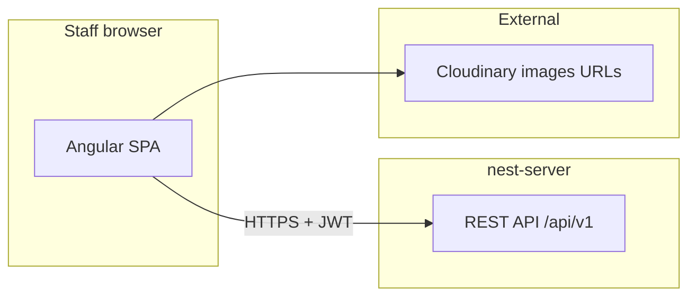

# Architecture — cvc-angular

**Sibling API repo:** `nest-server` — see `docs/ARCHITECTURE.md` there for persistence and HTTP services.

## System context

This app is a **single-page application** for **internal staff**. It does not implement server-side rendering for business data; all domain operations go through the **Nest API**.

## Front-end container

| Piece | Responsibility |
|-------|----------------|
| **Angular router** | Lazy-loaded feature modules under `LayoutComponent` |
| **`AuthGuard`** | Requires `localStorage` token; else redirect `/login` |
| **`ApiService`** | Base URL + JSON + Bearer token |
| **PrimeNG + layout** | Sakai-style shell: sidebar, topbar, content (`core/layout/`) |

## Feature modules (lazy)

| Route prefix | Module folder | Purpose |
|--------------|---------------|---------|
| `/dashboard` | `modules/dashboard` | Landing stats |
| `/products` | `modules/product` | Catalog CRUD |
| `/customers` | `modules/customers` | Customer CRUD |
| `/orders` | `modules/order` | List, create/edit wizard (`CreateOrderV2Component`) |
| `/order-sources` | `modules/order-source` | Sales channel configuration |
| `/reports` | `modules/reports` | Charts and report views |

## Cross-cutting UI concerns

- **Scroll behavior:** `LayoutComponent` toggles `layout-scrollable` for long pages (dashboard, reports, order create/edit) so flex tables work elsewhere.
- **Dialogs:** `DialogService` (PrimeNG dynamic dialog) registered in `app.config.ts`.
- **Static data:** Large JSON datasets (e.g. cities) under `src/assets/data/`.

## Related decisions

See [`docs/adr/`](adr/) for UI-related ADRs (standalone structure, API client conventions).
